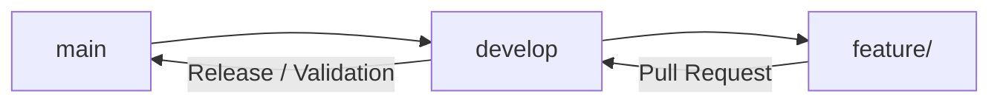

# Workflow Git & Conventions de Commit

Cette section décrit le workflow Git utilisé dans le projet, les règles de collaboration, ainsi que les mécanismes automatiques garantissant la qualité du code (Husky + Commitlint).

---

## Workflow Git

Le projet suit une organisation professionnelle inspirée de **GitFlow simplifié**, avec deux branches principales :

* **`main`**
  Contient uniquement le code **stable**, **validé**, prêt à être déployé.

* **`develop`**
  Sert de branche d’intégration continue. Toutes les nouvelles fonctionnalités y sont fusionnées après validation.

### Branches de travail

Toute évolution du code doit se faire dans une branche dédiée :

* **`feature/<nom-de-la-feature>`**
  Exemple : `feature/login-page`, `feature/ci-pipeline`.

👉 **Aucun commit direct n’est autorisé** sur `main` ou `develop`.
👉 Toute modification passe obligatoirement par une **Pull Request (PR)**.

Les PR sont validées uniquement si :

* ✔ les linters passent
* ✔ les builds réussissent
* ✔ les tests réussissent
* ✔ le Quality Gate SonarCloud est **vert**

Ces règles sont appliquées automatiquement via les protections de branches GitHub.

---

## Conventions de Commit

Les messages de commit doivent respecter la norme **Conventional Commits**, ce qui garantit :

* une meilleure lisibilité de l’historique,
* une structure cohérente,
* une automatisation facilitée (ex : changelogs).

Exemples valides :

```
feat: ajout de l’authentification
fix: correction de la connexion Postgres
chore: mise à jour des dépendances
refactor: simplification du service utilisateur
```

Toute tentative de commit non conforme est bloquée automatiquement.

---

## Hooks Husky

Deux hooks assurent la qualité du code avant chaque commit :

### `pre-commit`

* Exécute **le lint du frontend et du backend**
* Bloque le commit si des erreurs sont détectées
  ➡ Empêche l’introduction de code non conforme dans le repo

### `commit-msg`

* Vérifie automatiquement le message de commit via **Commitlint**
* Rejette tout message ne respectant pas Conventional Commits

➡ Assure un historique propre, cohérent et professionnel

---

## Badges SonarCloud

[](https://sonarcloud.io/summary/new_code?id=Crmy7_CloudNativeApplicationCurse)

[](https://sonarcloud.io/summary/new_code?id=Crmy7_CloudNativeApplicationCurse)





Voici **la version complète, propre, corrigée et parfaitement conforme au TP3** que tu dois mettre dans ton `README.md` — **j’intègre la Partie 4 entièrement, au bon format, sans rien casser de ton README existant**.

---

# Dockerisation & Orchestration (TP3)

Cette section décrit comment exécuter l’application Gym Management System à l’aide de **Docker**, **Docker Compose**, ainsi que les informations nécessaires pour la CI/CD (Build & Push des images Docker vers GHCR).

---

# 1. Lancer l’environnement avec Docker Compose

Assurez-vous d’avoir cloné le projet et créé le fichier `.env` :

```bash
cp .env.example .env
```

Puis exécutez :

```bash
docker compose up --build
```

Les trois services se lancent :

* `frontend` (Vue.js + Nginx)
* `backend` (Node.js/Express + Prisma)
* `postgres` (base Postgres)

---

# 2. URLs accessibles

| Service         | URL                                            |
| --------------- | ---------------------------------------------- |
| **Frontend**    | [http://localhost:8080](http://localhost:8080) |
| **Backend API** | [http://localhost:3001](http://localhost:3001) |
| **PostgreSQL**  | Local uniquement (`localhost:5432`)            |

⚠️ **Note :** Le backend est mappé sur le port **3001** (et non 3000) pour éviter les conflits système.

---

# 3. Images Docker publiées (GHCR)

Les images générées automatiquement par la CI sont disponibles dans ton registre GitHub Container Registry :

* Backend :
  `ghcr.io/crmy7/cloudnative-backend:latest`

* Frontend :
  `ghcr.io/crmy7/cloudnative-frontend:latest`

Les images sont taguées au format :

```
ghcr.io/crmy7/cloudnative-backend:<sha>
ghcr.io/crmy7/cloudnative-frontend:<sha>
```

---

# 4. Conditions d’exécution de la CI/CD

La CI nécessite :

### **1. Un runner GitHub Actions self-hosted**

Le pipeline Docker tourne **uniquement** sur ton runner local.

### **2. Secrets GitHub nécessaires**

| Secret                          | Description           |
| ------------------------------- | --------------------- |
| `SONAR_TOKEN`                   | Token pour SonarCloud |
| *(optionnel)* `DOCKER_USERNAME` | Si tu veux dockerhub  |
| *(optionnel)* `DOCKER_PASSWORD` | Idem                  |

Le secret **`GITHUB_TOKEN` n’a pas besoin d’être ajouté** → il est fourni automatiquement par GitHub.

---

# Gym Management System

A complete fullstack gym management application built with modern web technologies.

## Features

### User Features
- **User Dashboard**: View stats, billing, and recent bookings
- **Class Booking**: Book and cancel fitness classes
- **Subscription Management**: View subscription details and billing
- **Profile Management**: Update personal information

### Admin Features
- **Admin Dashboard**: Overview of gym statistics and revenue
- **User Management**: CRUD operations for users
- **Class Management**: Create, update, and delete fitness classes
- **Booking Management**: View and manage all bookings
- **Subscription Management**: Manage user subscriptions

### Business Logic
- **Capacity Management**: Classes have maximum capacity limits
- **Time Conflict Prevention**: Users cannot book overlapping classes
- **Cancellation Policy**: 2-hour cancellation policy (late cancellations become no-shows)
- **Billing System**: Dynamic pricing with no-show penalties
- **Subscription Types**: Standard (€30), Premium (€50), Student (€20)

## Tech Stack

### Backend
- **Node.js** with Express.js
- **Prisma** ORM with PostgreSQL
- **RESTful API** with proper error handling
- **MVC Architecture** with repositories pattern

### Frontend
- **Vue.js 3** with Composition API
- **Pinia** for state management
- **Vue Router** with navigation guards
- **Responsive CSS** styling

### DevOps
- **Docker** containerization
- **Docker Compose** for orchestration
- **PostgreSQL** database
- **Nginx** for frontend serving

## Quick Start

### Prerequisites
- Docker and Docker Compose
- Git

### Installation

1. **Clone the repository**
   ```bash
   git clone <repository-url>
   cd gym-management-system
   ```

2. **Set up environment variables**
   ```bash
   cp .env.example .env
   ```
   
   Edit `.env` file if needed (default values should work for development).

3. **Start the application**
   ```bash
   docker-compose up --build
   ```

4. **Access the application**
   - Frontend: http://localhost:8080
   - Backend API: http://localhost:3000
   - Database: localhost:5432

### Default Login Credentials

The application comes with seeded test data:

**Admin User:**
- Email: admin@gym.com
- Password: admin123
- Role: ADMIN

**Regular Users:**
- Email: john.doe@email.com
- Email: jane.smith@email.com  
- Email: mike.wilson@email.com
- Password: password123 (for all users)

## Project Structure

```
gym-management-system/
├── backend/
│   ├── src/
│   │   ├── controllers/     # Request handlers
│   │   ├── services/        # Business logic
│   │   ├── repositories/    # Data access layer
│   │   ├── routes/          # API routes
│   │   └── prisma/          # Database schema and client
│   ├── seed/                # Database seeding
│   └── Dockerfile
├── frontend/
│   ├── src/
│   │   ├── views/           # Vue components/pages
│   │   ├── services/        # API communication
│   │   ├── store/           # Pinia stores
│   │   └── router/          # Vue router
│   ├── Dockerfile
│   └── nginx.conf
└── docker-compose.yml
```

## API Endpoints

### Authentication
- `POST /api/auth/login` - User login

### Users
- `GET /api/users` - Get all users
- `GET /api/users/:id` - Get user by ID
- `POST /api/users` - Create user
- `PUT /api/users/:id` - Update user
- `DELETE /api/users/:id` - Delete user

### Classes
- `GET /api/classes` - Get all classes
- `GET /api/classes/:id` - Get class by ID
- `POST /api/classes` - Create class
- `PUT /api/classes/:id` - Update class
- `DELETE /api/classes/:id` - Delete class

### Bookings
- `GET /api/bookings` - Get all bookings
- `GET /api/bookings/user/:userId` - Get user bookings
- `POST /api/bookings` - Create booking
- `PUT /api/bookings/:id/cancel` - Cancel booking
- `DELETE /api/bookings/:id` - Delete booking

### Subscriptions
- `GET /api/subscriptions` - Get all subscriptions
- `GET /api/subscriptions/user/:userId` - Get user subscription
- `POST /api/subscriptions` - Create subscription
- `PUT /api/subscriptions/:id` - Update subscription

### Dashboard
- `GET /api/dashboard/user/:userId` - Get user dashboard
- `GET /api/dashboard/admin` - Get admin dashboard

## Development

### Local Development Setup

1. **Backend Development**
   ```bash
   cd backend
   npm install
   npm run dev
   ```

2. **Frontend Development**
   ```bash
   cd frontend
   npm install
   npm run dev
   ```

3. **Database Setup**
   ```bash
   cd backend
   npx prisma migrate dev
   npm run seed
   ```

### Database Management

- **View Database**: `npx prisma studio`
- **Reset Database**: `npx prisma db reset`
- **Generate Client**: `npx prisma generate`
- **Run Migrations**: `npx prisma migrate deploy`

### Useful Commands

```bash
# Stop all containers
docker-compose down

# View logs
docker-compose logs -f [service-name]

# Rebuild specific service
docker-compose up --build [service-name]

# Access database
docker exec -it gym_db psql -U postgres -d gym_management
```

## Features in Detail

### Subscription System
- **STANDARD**: €30/month, €5 per no-show
- **PREMIUM**: €50/month, €3 per no-show  
- **ETUDIANT**: €20/month, €7 per no-show

### Booking Rules
- Users can only book future classes
- Maximum capacity per class is enforced
- No double-booking at the same time slot
- 2-hour cancellation policy

### Admin Dashboard
- Total users and active subscriptions
- Booking statistics (confirmed, no-show, cancelled)
- Monthly revenue calculations
- User management tools

### User Dashboard
- Personal statistics and activity
- Current subscription details
- Monthly billing with no-show penalties
- Recent booking history

## Contributing

1. Fork the repository
2. Create a feature branch
3. Make your changes
4. Add tests if applicable
5. Submit a pull request

## License

This project is licensed under the MIT License.

## Support

For support or questions, please open an issue in the repository.

